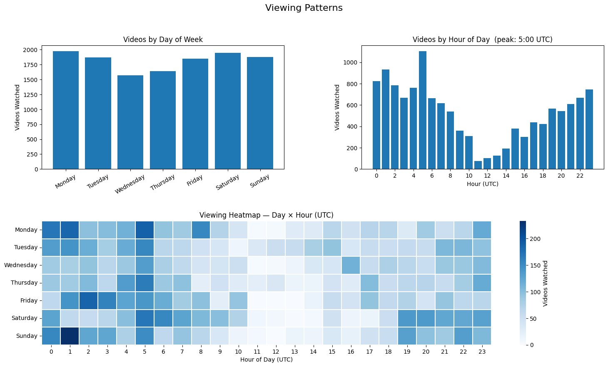
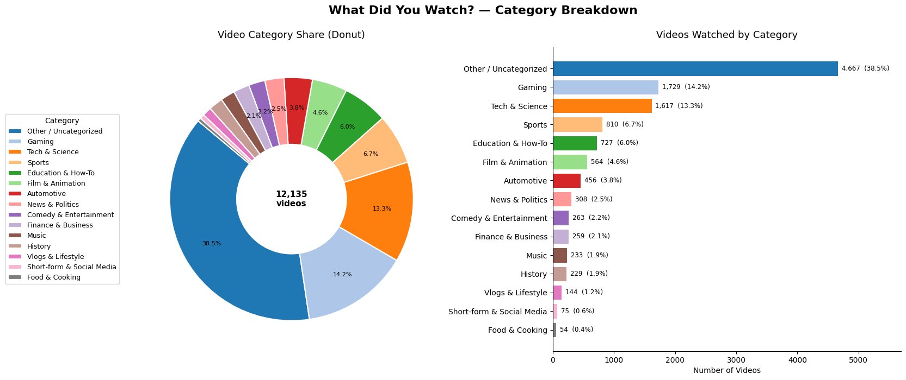

# YouTube Behavior Analysis (Google Takeout)

## Overview
This project analyzes YouTube watch history and search history exported from Google Takeout.
The goal is to transform non-tabular JSON activity data into a structured dataset and explore behavioral patterns over time using Python and data visualization.

The analysis focuses on understanding viewing habits, search behavior, and content preferences while maintaining user privacy through aggregated outputs only.

## Objectives
- Convert raw JSON activity logs into tabular datasets
- Analyze viewing patterns by time and date
- Identify most watched channels
- Compare activity across years
- Categorize watched content using keyword-based NLP
- Produce privacy-safe analytical outputs

## Dataset
Source: Google Takeout (YouTube Watch & Search History)

Raw files are excluded from this repository for privacy reasons.

## Workflow
1. Load Google Takeout JSON exports
2. Normalize nested structures into DataFrames
3. Feature engineering (datetime, weekday, hour, year)
4. Behavioral visualization and analysis
5. Content categorization (keyword + channel fallback method)
6. Export aggregated, privacy-safe results

## Sample Visualizations

(Images generated from anonymized aggregated data.)

## Quick Stats

(Generated from the analyzed dataset)

Watch records: 12,720

Search records: 3,669

Categories identified: 14+ content themes

## Key Outputs
- Viewing patterns by hour and weekday
- Top watched channels
- Year-over-year activity comparisons
- Aggregated CSV outputs
- Search Behaviour Analysis
- Year-over-year activity comparisons
- Content Theme Analysis
- Aggregated CSV outputs

## How to Run
1. Place Takeout JSON files inside `data/`
2. Open `/notebooks/youtube_behavior_analysis.ipynb`
3. Run all cells from top to bottom

## Privacy
Raw activity data is excluded using `.gitignore`. Only aggregated,
non-identifiable outputs are published.
